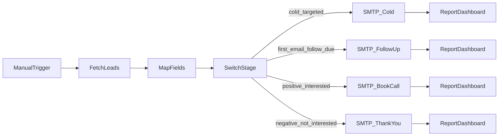

# n8n Lead Outreach – Visual Flow (cPanel SMTP)

**Workflow:** Dimension Group Lead Outreach – cPanel SMTP  
**Import:** `n8n-lead-outreach-workflow.json`

## Stage → email

| Switch | SMTP node | Dashboard after send |
|--------|-----------|----------------------|
| cold, targeted | Send Cold Email | `first_email_sent` |
| first_email_sent, follow_up_due | Send Follow-Up | `follow_up_sent` |
| positive_reply, interested | Send Book Call | note only |
| negative_reply, not_interested | Send Thank You | note only |

Mail transport: **cPanel SMTP** (`mail.dimensiongroupglobal.com`), not Gmail.
